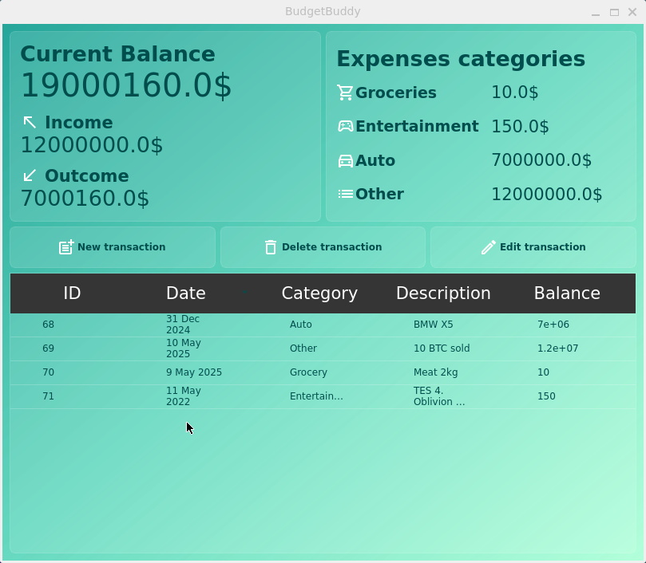

# 💰 BudgetBuddy



 Десктопное приложение для учета личных финансов с графическим интерфейсом.

## ✨ Функционал

- 📊 Ведение учета доходов и расходов
- 🏷️ Категоризация операций по пользовательским тегам
- ✏️ Редактирование истории транзакций

## 🛠️ Стек технологий

- **Язык**: Python 3.10.12
- **GUI**: PySide6 (Qt для Python)
- **База данных**: SQLite3 (локальное хранение данных)
- **Тестирование**: unittest
- **Сборка**: pip + requirements.txt

## ⚙️ Установка

```
git clone git@github.com:xxinxl/BudgetBuddyDesktop.git
cd BudgetBuddyDesktop
make install
```

### 📋 Требования

- Python 3.10+
- pip
- Pyside6

## 🚀 Запуск

```
make run
```

При первом запуске автоматически создается:
- Файл базы данных `budget.db` (SQLite3)
- Стандартные категории расходов

## 🗃️ Структура БД (SQLite3)
### Таблица `expenses`
| Поле         | Тип данных  | Описание                          |
|--------------|-------------|-----------------------------------|
| `id`         | INTEGER     | Уникальный идентификатор          |
| `date`       | TEXT        | Дата операции                     |
| `category`   | TEXT        | Категория операции                |
| `amount`     | REAL        | Сумма (положительная для доходов) |
| `description`| TEXT        | Детали операции                   |
| `balance`    | REAL        | Текущий баланс                    |
| `status`     | TEXT        | 'income'/'outcome'                |


## 🧪 Тестирование

```
make test
```
## 👥 Команда разработчиков

- **Вадим Томин** - Project-manager
- **Наталия Лямина** - Fullstack-разработчик
- **Мария Сидорова** - Frontend-разработчик / тестировщик
- **Олег Кульков** - Backend-разработчик
